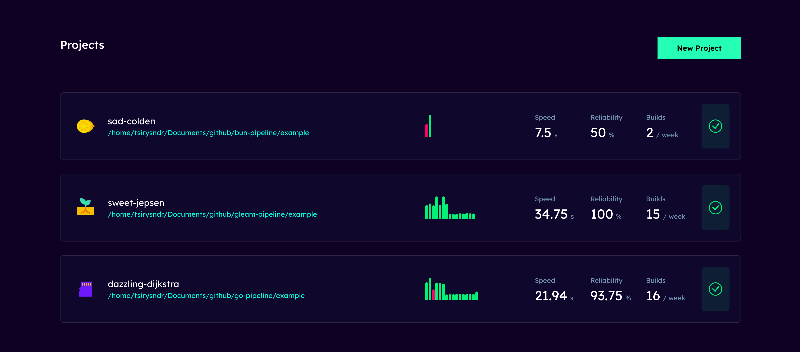

# Fluent CI CLI

[](https://flakehub.com/flake/fluentci-io/fluentci)
[](https://flakestry.dev/flake/github/fluentci-io/fluentci)
[](https://deno.land/x/fluentci)

[](https://discord.gg/V4U6dPskKc)


Fluent CI is a CI/CD tool that allows you to build, test, and deploy your code. It is a self-hosted solution built on top of [Dagger](https://dagger.io), [Wasm](https://webassembly.org/) and [Deno](https://deno.com/), can be run locally or on a server, and is completely free and open-source.

It is also a registry of pre-built pipelines. This means you don't have to write your CI/CD configuration from scratch. You can simply search for and use pipelines that others have already built for frameworks like Django, React, Node, etc.

<br clear="both"/>

<p align="left">
    <a href="https://devhunt.org/tool/fluent-ci" title="DevHunt - Tool of the Week" target="_blank"></a>&nbsp;
</p>

## ✨ Features

* __Single Command__: Manage your CI/CD pipeline locally with a single command.
* __Runs everywhere__: Run your pipeline on any machine - whether it's local, remote, cloud-based, physical server, or a VM & any architecture x86 or ARM.
* __Export to Your CI/CD__: Export your FluentCI pipeline to any CI Provider like GitHub Actions, GitLab CI, Azure Pipelines, AWS CodePipeline, CircleCI etc.
* __Web UI__: Manage your pipelines with a web-based user interface, see [FluentCI Studio](https://github.com/fluentci-io/fluentci-studio).
* __Registry__: Search for reusable pipelines in the FluentCI Registry.
* __Nix__: Run your pipeline in a Nix environment instead of Docker (optional).
* __Extensibility__: Enable extensibility with plugin. Write your own plugin in TypeScript, Rust or any language that compiles to WebAssembly.
* __Works on my Machine__: Never experience it again.

## 🚚 Installation

using [Deno](https://deno.com) (recommended) :

```bash
deno install -A -g -r https://cli.fluentci.io -n fluentci
```

using Bash (Linux/macOS) :

```bash
curl -fsSL https://cli.fluentci.io | bash
```

using [Homebrew](https://brew.sh) :

```bash
brew install fluentci-io/tap/fluentci
```

using [Pkgx](https://pkgx.sh/) :

```bash
pkgx install fluentci
```

using [Nix](https://nixos.org) :

```bash
nix profile install --experimental-features "nix-command flakes" github:fluentci-io/fluentci
```

using [Docker](https://www.docker.com) :

```bash
docker run --privileged \
-v /var/run/docker.sock:/var/run/docker.sock \
-it ghcr.io/fluentci-io/cli:latest run base_pipeline
```

Or download the binary from the [releases page](https://github.com/fluentci-io/fluentci/releases) and add it to your PATH.

Requirements:
- [Deno](https://deno.com) 1.42 or higher. See [Deno Installation](https://deno.land/manual/getting_started/installation) for more information.
- [Dagger](https://dagger.io) 0.11.7 or higher. See [Dagger Installation](https://docs.dagger.io/cli/465058/install) for more information.

## 📦 Downloads

**Latest (Desktop):**

- `Mac`: arm64: [fluentci-studio_v0.1.4_arm64.dmg](https://github.com/fluentci-io/fluentci-studio/releases/download/v0.1.4/fluentci-studio_v0.1.4_arm64.dmg) intel: [fluentci-studio_v0.1.4_x64.dmg](https://github.com/fluentci-io/fluentci-studio/releases/download/v0.1.4/fluentci-studio_v0.1.4_x64.dmg)
- `Linux`: [fluentci-studio_v0.1.4.AppImage](https://github.com/fluentci-io/fluentci-studio/releases/download/v0.1.4/fluentci-studio_v0.1.4.AppImage)

**Latest (CLI):**

- `Mac`: arm64: [fluentci_v0.15.0_aarch64-apple-darwin.tar.gz](https://github.com/fluentci-io/fluentci/releases/download/v0.15.0/fluentci_v0.15.0_aarch64-apple-darwin.tar.gz) intel: [fluentci_v0.15.0_x86_64-apple-darwin.tar.gz](https://github.com/fluentci-io/fluentci/releases/download/v0.15.0/fluentci_v0.15.0_x86_64-apple-darwin.tar.gz)
- `Linux`: intel: [fluentci_v0.15.0_x86_64-unknown-linux-gnu.tar.gz](https://github.com/fluentci-io/fluentci/releases/download/v0.15.0/fluentci_v0.15.0_x86_64-unknown-linux-gnu.tar.gz) arm64: [fluentci_v0.15.0_aarch64-unknown-linux-gnu.tar.gz](https://github.com/fluentci-io/fluentci/releases/download/v0.15.0/fluentci_v0.15.0_aarch64-unknown-linux-gnu.tar.gz)

## ✨ Quick Start

Setup a new pipeline in your current directory and run it by using the following commands:

```bash
fluentci init # Initialize a new pipeline in the current directory
fluentci # Run the pipeline
```

Or start [FluentCI Studio](https://github.com/fluentci-io/fluentci-studio):

```bash
fluentci studio
```

## 🚀 Usage

```bash
fluentci --help

Usage:   fluentci [pipeline] [jobs...]
Version: 0.15.1                      

Description:

  .                                                                                    
      ______              __  _________                                                
     / __/ /_ _____ ___  / /_/ ___/  _/                                                
    / _// / // / -_) _ \/ __/ /___/ /                                                  
   /_/ /_/\_,_/\__/_//_/\__/\___/___/                                                  
                                                                                       
  FluentCI CLI - An Open Source CI/CD tool written in TypeScript (Deno) based on Wasm Plugins and Dagger

Options:

  -h, --help             - Show this help.                            
  -V, --version          - Show the version number for this program.  
  -r, --reload           - Reload pipeline source cache               
  -w, --wasm             - Run pipeline as WebAssembly Module         
  --remote-exec          - Run pipeline on remote agent               
  -*, --*        [args]  - Pass arguments to pipeline                 

Commands:

  run        <pipeline> [jobs...]  - Run a pipeline                                            
  init       [pipeline-name]       - Initialize a new pipeline                                 
  search     <query>               - Search for reusable pipelines                             
  upgrade                          - Upgrade FluentCI CLI to the latest version                
  cache      [pipeline]            - Cache remote dependencies of a pipeline                   
  ls, list   [pipeline]            - List all jobs in a pipeline                               
  docs, man  [pipeline]            - Show documentation for a pipeline                         
  doctor                           - Check if FluentCI CLI is installed correctly              
  env                              - Show environment variables (read from .fluentci/.env file)
  login                            - Login to FluentCI                                         
  publish                          - Publish a pipeline to FluentCI Registry                   
  agent                            - Start FluentCI Runner Agent                               
  whoami                           - Show current logged in user                               
  repl       [pipelines...]        - Start FluentCI REPL                                       
  studio                           - Start FluentCI Studio, a web-based user interface         
  project                          - Manage projects                                 
  server                           - Start FluentCI GraphQL Server     
```

## 📚 Documentation

[View the full documentation](https://docs.fluentci.io)

## ✍️ Feedback

This repository is the central place to collect feedback and issues related to FluentCI CLI.

Please [**open an issue**](https://github.com/fluentci-io/fluentci/issues/new) if you want to leave feedback. Feel free to also join our [**Discord server**](https://discord.gg/V4U6dPskKc)

## 🤝 Contributing

We would love to hear your feedback or suggestions. The best way to reach us is on [Discord](https://discord.gg/H7M28d9dRk).

We also welcome pull requests into this repo. See [CONTRIBUTING.md](CONTRIBUTING.md) for information on setting up this repo locally.
